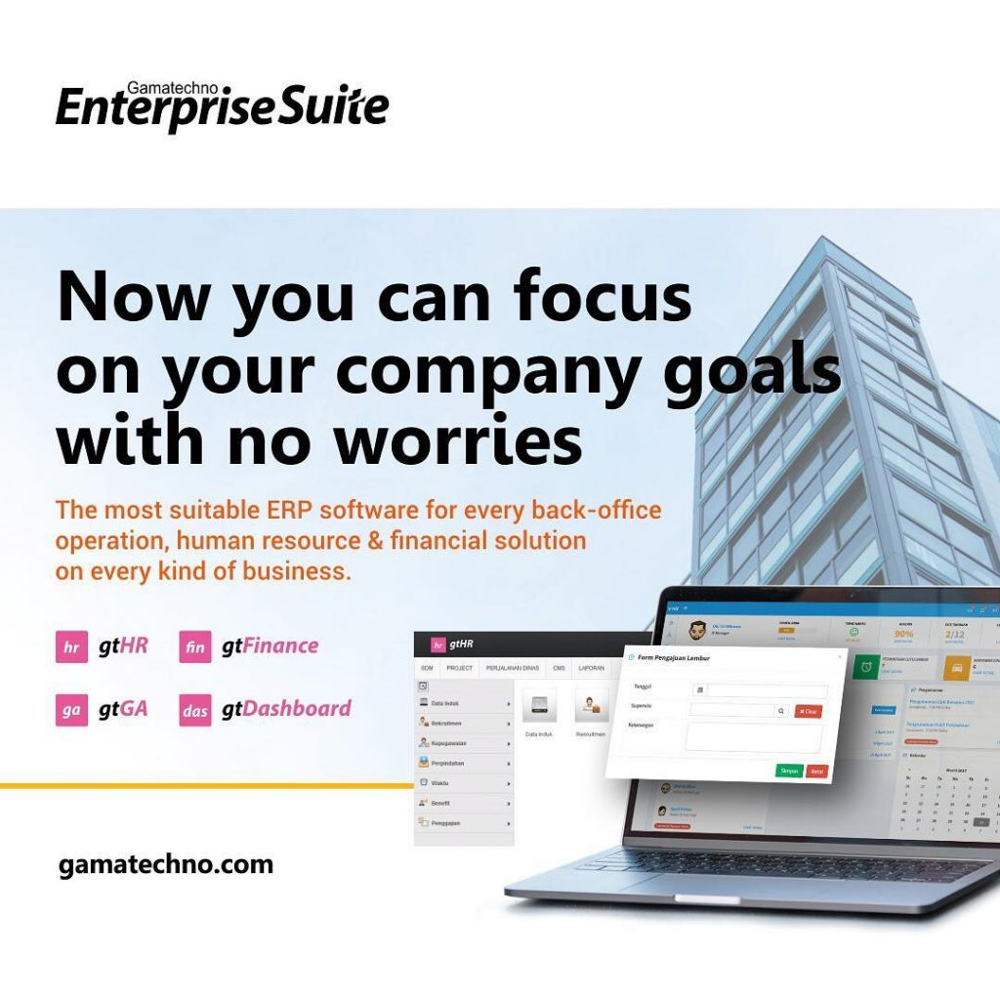

# Bisnis Sebagai Layanan (BPaaS)
## Pengertian
Proses Bisnis Sebagai Layanan (BPaaS) adalah jenis proses bisnis horizontal atau vertikal yang disampaikan berdasarkan model layanan awan. Layanan awan ini - yang mencakup Perangkat Lunak sebagai Layanan (SaaS),  Platform sebagai Layanan (PaaS), dan Infrastruktur sebagai Layanan (IaaS) - oleh karena itu bergantung pada layanan terkait.
## Karakteristik
Karakteristik berikut menentukan BPAaS:
1. BPaaS duduk di atas tiga layanan awan pendiri lainnya: SaaS, PaaS, dan IaaS.
2. Layanan BPaaS dapat dikonfigurasi berdasarkan proses yang sedang dirancang.
3. Layanan BPaaS harus memiliki API yang terdefinisi dengan baik sehingga mudah dihubungkan ke layanan terkait.
4. BPaaS harus dapat mendukung banyak bahasa dan beberapa lingkungan penerapan karena bisnis tidak dapat memprediksi bagaimana proses bisnis akan dimanfaatkan di masa depan.
5. Lingkungan BPaaS harus bisa menangani skala besar. Layanan harus bisa pergi dari pengelolaan beberapa proses untuk beberapa pelanggan untuk dapat mendukung ratusan bahkan ribuan pelanggan dan proses. Layanan ini mencapai tujuan tersebut dengan mengoptimalkan layanan awan yang mendasari untuk mendukung jenis elastisitas dan penskalaan ini.
## Contoh Aplikasi BPAAS

### gtFinance

gtFinance adalah software untuk mempermudah pengelolaan anggaran, keuangan dan akuntansi di perusahaan. Fitur meliputi pengaturan anggaran (budget control), dimulai dari proses perencanaan, pencatatan penggunaan anggaran hingga pelacakan penggunaan anggaran (budget tracking). Software ini dilengkapi dengan fitur penjurnalan otomatis yang akan dapat mempermudah beban kerja akuntan dan bagian keuangan. Terakhir adalah laporan (standar laporan keuangan) dapat dikumpulkan dan ditampilkan dengan lebih cepat dan akurat.
gtEnterprise Finance dibangun dengan tujuan untuk mempermudah pemilik atau pengelola perusahaan dalam mengalokasikan dan mengontrol anggaran, mengetahui dengan tepat kondisi keuangan perusahaan yang pada akhirnya dapat mengambil keputusan yang tepat berbasis data-data yang disajikan  tersebut.

Referensi : https://www.gamatechno.com/products-services-detail/corporate-suite/250-gtfinance-2
https://id.howtodou.com/what-is-business-process-as-service-in-cloud-computing