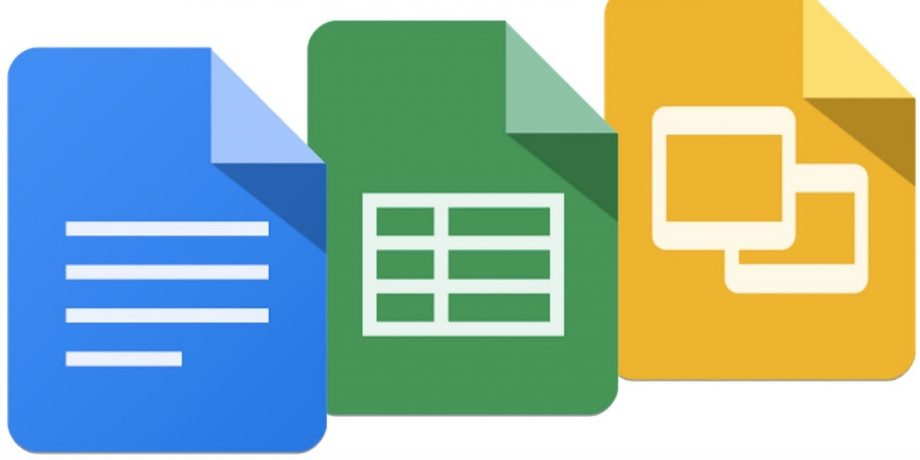
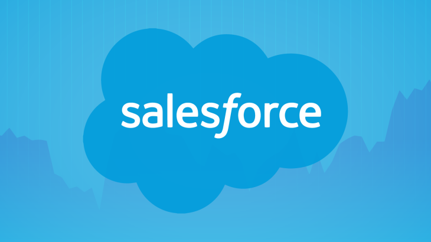

# Software as a Services

## Pengertian SaaS
SaaS (software as a service atau perangkat lunak berbentuk layanan) adalah suatu model penyampaian aplikasi perangkat lunak oleh suatu vendor perangkat lunak yang mengembangkan aplikasi web yang diinangi dan dioperasikan (baik secara mandiri maupun melalui pihak ketiga) untuk digunakan oleh pelanggannya melalui Internet. 

## Kelebihan 
Pengguna dapat langsung memanfaatkan layanan secara gratis atau dengan bayar biaya sewa tanpa harus mengeluarkan investasi untuk membuat sendiri (in-house development) atau membeli lisensi yang relatif mahal.
Ketersediaan dan reliabilitas aplikasi terjamin oleh penyedia layanan. Pengguna hanya perlu fokus pada data miliknya. Perangkat yang dibutuhkan oleh pengguna juga hanya komputer dan internet.
## Kekurangan
Pengguna tidak memiliki kendali penuh atas aplikasi yang disewa. Pengguna tidak dapat dengan seenaknya mengubah fitur-fitur yang disediakan karena SaaS bersifat multi-tenant sehingga fitur-fitur yang dibuat adalah fitur yang umum (tidak bisa spesifik terhadap kebutuhan pengguna tertentu). Pada beberapa aplikasi, kustomisasi dapat dilakukan dengan skala dan fungsi yang terbatas.
## Contoh Software
1. Google Apps (Docs, Spreadsheet, Slides)

2. Adobe Creative Clouds

3. Salesforce
