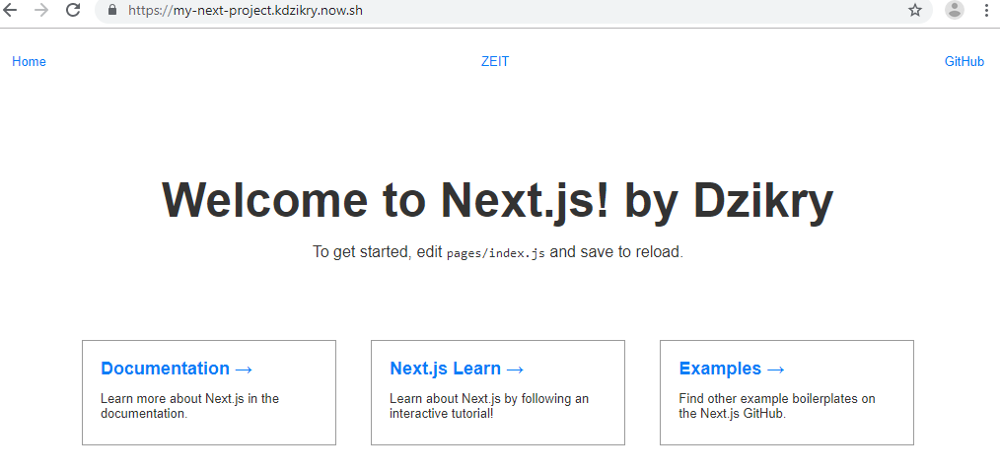

## Minggu ke 7

# Zeit

### Install npm i -g now
```

PS C:\Users\Student> npm i -g now

> now@16.4.0 preinstall C:\Users\Student\AppData\Roaming\npm\node_modules\now
> node ./scripts/preinstall.js

C:\Users\Student\AppData\Roaming\npm\now -> C:\Users\Student\AppData\Roaming\npm\node_modules\now\dist\index.js
+ now@16.4.0
added 1 package in 150.269s
PS C:\Users\Student>
```

### now login
```
Student@DESKTOP-B8ACH4F MINGW64 ~
$ now login kdzikry@gmail.com
- Sending you an email
> We sent an email to kdzikry@gmail.com. Please follow the steps provided
  inside it and make sure the security code matches Pragmatic Hamster.
- Waiting for your confirmation
v Email confirmed
> Congratulations! You are now logged in. In order to deploy something, run `now`.

Student@DESKTOP-B8ACH4F MINGW64 ~

```
### Creating Project & Dploying

```
Student@DESKTOP-B8ACH4F MINGW64 ~
$ npm init next-app my-next-project

npx: installed 1 in 3.938s
Creating a new Next.js app in C:\Users\Student\my-next-project.

Installing react, react-dom, and next using npm...

> core-js@2.6.10 postinstall C:\Users\Student\my-next-project\node_modules\core-js
> node postinstall || echo "ignore"

+ react-dom@16.10.2
+ react@16.10.2
+ next@9.1.1
added 754 packages from 357 contributors and audited 10230 packages in 267.49s
found 0 vulnerabilities


Success! Created my-next-project at C:\Users\Student\my-next-project
Inside that directory, you can run several commands:

  npm run dev
    Starts the development server.

  npm run build
    Builds the app for production.

  npm start
    Runs the built app in production mode.

We suggest that you begin by typing:

  cd my-next-project
  npm run dev


Student@DESKTOP-B8ACH4F MINGW64 ~

```

### Menjalankan Project
```
Student@DESKTOP-B8ACH4F MINGW64 ~
$ cd my-next-project

Student@DESKTOP-B8ACH4F MINGW64 ~/my-next-project
$ now
> Deploying ~\my-next-project under kdzikry
> Using project my-next-project
> NOTE: This is the first deployment in the my-next-project project. It will be promoted to production.
> NOTE: To deploy to production in the future, run `now --prod`.
https://my-next-project-ab7j2obe0.now.sh
- Building...

- Finalizing...
> Ready! Deployed to https://my-next-project.kdzikry.now.sh [in clipboard] [37s]

Student@DESKTOP-B8ACH4F MINGW64 ~/my-next-project
$

```
