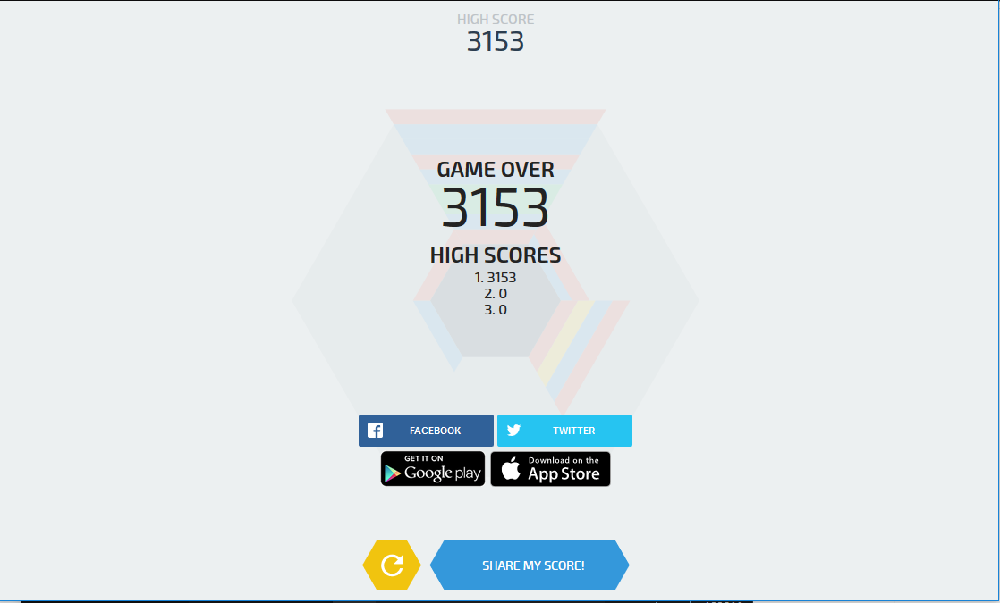

# Docker ft. UTS


## Folder & file
### Buka docker
Masuk folder yang telah dibuat dan clone file

```
PS D:\kuliah\Semester5\praktikum-tcc\tcc\uts\hextris> git clone https://github.com/Hextris/hextris.git
Cloning into 'hextris'...
remote: Enumerating objects: 6, done.
remote: Counting objects: 100% (6/6), done.
remote: Compressing objects: 100% (4/4), done.

Receiving objects: 100% (5046/5046), 26.69 MiB | 543.00 KiB/s, done.
```

## Build Image

```
PS D:\kuliah\Semester5\praktikum-tcc\tcc\uts> docker build -t kdzikry/hextris-game:v1 .
Sending build context to Docker daemon  29.69MB
Step 1/2 : FROM nginx:alpine
alpine: Pulling from library/nginx
89d9c30c1d48: Pull complete
110ad692b782: Pull complete
Digest: sha256:085e84650dbe56f27ca3ed00063a12d5b486e40c3d16d83c4e6c2aad1e4045ab
Status: Downloaded newer image for nginx:alpine
 ---> b6753551581f
Step 2/2 : COPY ./hextris /usr/share/nginx/html
 ---> 63dc460f2e4d
Successfully built 63dc460f2e4d
Successfully tagged kdzikry/hextris-game:v1
SECURITY WARNING: You are building a Docker image from Windows against a non-Windows Docker host. All files and director
ies added to build context will have '-rwxr-xr-x' permissions. It is recommended to double check and reset permissions f
or sensitive files and directories.
```

## Dockerfile
Buat Dockerfile 
```
FROM nginx:alpine
COPY ./hextris /usr/share/nginx/html
```

## Menjalankan Image
```
PS D:\kuliah\Semester5\praktikum-tcc\tcc\uts> docker run -d -p 8080:80 --name=hextris kdzikry/hextris-game:v1
ca80aa3c21780668c616a018be9de4ca95244d67e6664536732c5ae9796ef43a
```
 
## Login & Push ke Docker Hub
```
PS D:\kuliah\Semester5\praktikum-tcc\tcc\uts> docker login -u=kdzikry -p=inipassword
WARNING! Using --password via the CLI is insecure. Use --password-stdin.
WARNING! Your password will be stored unencrypted in C:\Users\ademin\.docker\config.json.
Configure a credential helper to remove this warning. See
https://docs.docker.com/engine/reference/commandline/login/#credentials-store

Login Succeeded
PS D:\kuliah\Semester5\praktikum-tcc\tcc\uts> docker push kdzikry/hextris-game:v1
The push refers to repository [docker.io/kdzikry/hextris-game]
2be4763e1519: Pushed
bba7d2385bc1: Mounted from library/nginx
77cae8ab23bf: Mounted from library/nginx
v1: digest: sha256:7b5e9e73ddbc14d88e70a8e5ea1f4c8425564cfc2c622dc6e68ba2b250d85af8 size: 951
PS D:\kuliah\Semester5\praktikum-tcc\tcc\uts>
```
